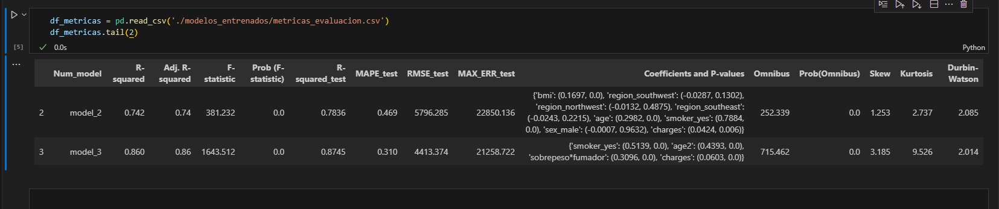
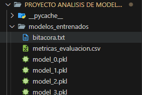
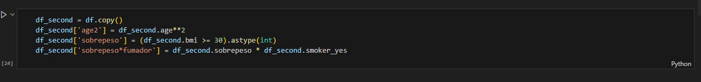

# TEMPLATE - REGRESION LINEAL

Este pequeño proyecto busca agilizar el proceso de creación, entrenamiento y evaluación de modelos de regresión lineal con datos que nosotros seleccionemos. Además de manera directa estará: 

- Almacenando el **modelo**
- Almacenando sus ***métricas*** en un csv con nombre `metricas_evalucion.csv`,
- Actualizando una ***bitácora*** con nombre `bitacora.txt` la cual almacenara los nombres de las columnas, nombre del modelo y un comentario (variable `comentario` que podrá ser modificada por el usuario con lo que quiera resaltar de ese modelo)

Las métricas de evaluación de cada modelo serán almacenadas en un csv el cual podrá servir como una comparativa entre modelos y así saber cual esta teniendo un mejor performance

Los datos que almacenamos de cada modelo son los siguientes:

- Métricas de evaluación durante el entrenamiento: R-cuadrado, R-cuadrado ajustado, F-estadístico, P(F-estadístico)
- Métricas de evaluación con datos de testeo:   R-cuadrado, MAPE, RMSE, MAX_ERROR
- Coeficientes del modelo con sus P-valor:  Coeficientes del modelo y sus P-valor para saber que tan relevantes estan siendo esas variables
- Métricas de análisis de residuales: Ómnibus, P(Omnibus), Skew, Kurtosis, Durbin-Watson

Los modelos creados, las métricas y la bitácora estará almacenados en la carpeta `modelos_entrenados`

Este template consta de 3 secciones que describiremos brevemente aqui ya que estan mejor especificadas en el archivo (.ipynb). Las secciones son las siguientes:

- ***1. Selección de datos para el modelo***

Este espacio será útil para importar los datos y realizar las transformaciones necesarias a las variables que vamos a usar para el modelo:

Es importante recordar el dataframe final debe tener como nombre `df` ya que esto evitara incongruencias con el resto de código el cual se pretende ejecutarse de forma rápida

- ***2. Entrenamiento de Modelo y Evaluación***

En esta sección se entrenara, evaluara y almacenara el modelo de forma automática con los datos que hemos suministrado de la etapa anterior (dataframe:'df'). Es necesario que especifiquemos 2 variables antes de ejecutar el proceso:

- *y_col*: Variable objetivo o variable a predecir
- *comentario*: Aquí podemos agregar un comentario acerca de las modificaciones o transformaciones que realizamos a las columnas de variables independientes. Esta parte es opcional

- ***3. Modelos almacenados y sus métricas***
Aquí podemos abrir el csv con la información de los modelos que fueron almacenados para compararlos
